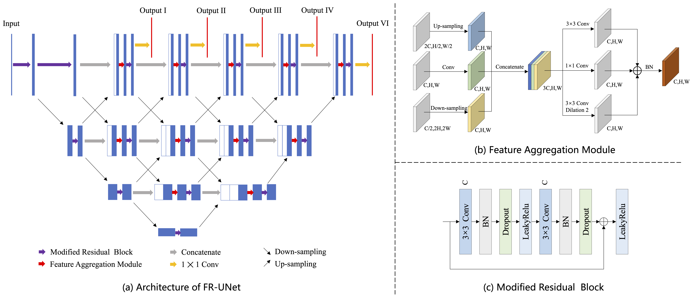

[](https://paperswithcode.com/sota/retinal-vessel-segmentation-on-drive?p=full-resolution-network-and-dual-threshold)[](https://paperswithcode.com/sota/retinal-vessel-segmentation-on-chase_db1?p=full-resolution-network-and-dual-threshold)
# FR-UNet
This repository is the official PyTorch code for the paper ['Full-Resolution Network 
and Dual-Threshold Iteration for Retinal Vessel and Coronary Angiograph Segmentation'](https://ieeexplore.ieee.org/abstract/document/9815506).


<div align="center">
  
</div>

 
## Prerequisites
 

 
Download our repo:
```
git clone https://github.com/lseventeen/RF-UNet.git
cd RF-UNet
```
Install packages from requirements.txt
```
pip install -r requirements.txt
```
 
## Datasets processing
Choose a path to create a folder with the dataset name and download datasets [DRIVE](https://www.dropbox.com/sh/z4hbbzqai0ilqht/AAARqnQhjq3wQcSVFNR__6xNa?dl=0),[CHASEDB1](https://blogs.kingston.ac.uk/retinal/chasedb1/),[STARE](https://cecas.clemson.edu/~ahoover/stare/probing/index.html),[CHUAC](https://figshare.com/s/4d24cf3d14bc901a94bf), and [DCA1](http://personal.cimat.mx:8181/~ivan.cruz/DB_Angiograms.html). Type this in terminal to run the data_process.py file
 
```
python data_process.py -dp DATASET_PATH -dn DATASET_NAME
```
 
## Training
Type this in terminal to run the train.py file
 
```
python train.py -dp DATASET_PATH
```
## Test
Type this in terminal to run the test.py file
 
```
python test.py -dp DATASET_PATH -wp WEIGHT_FILE_PATH
```
We have prepared the pre-trained models for both datasets in the folder 'pretrained_weights'. To replicate the results in the paper, directly run the following commands
```
python test.py -dp DATASET_PATH -wp pretrained_weights/DATASET_NAME
```


 
## License
 
This project is licensed under the MIT License - see the [LICENSE](LICENSE) file for details
 
